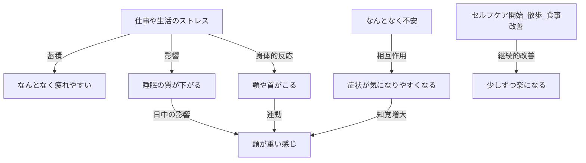
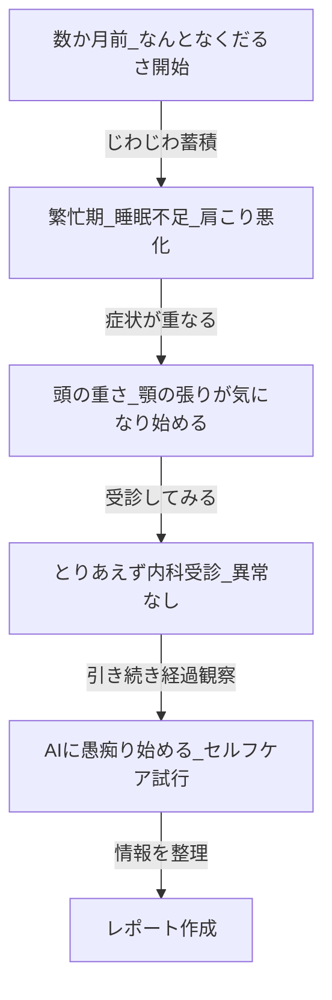

:::message
本記事に登場する症例・症状・人物はすべて**架空のものです**。  
特定の個人・患者を示すものではありません。  
本手法の説明のため、実話をもとに再構成してあります。
:::

## 愚痴？ → AI → 受診レポート

ちょっと妻の体調がすぐれない日が続いた。  
でも別に救急に行くほどでもない。  
どの科に行けばいいかもよくわからない。

妻が「ちょっと体調悪くて〜」と話してくるとき、  
ずっと聞き役になるのも、正直なかなかしんどい。  
愛情はある。でもキャパには限界がある。

そこで試したのが「**AIに愚痴の相手をさせる**」という方法だ。

---

## やったこと

妻にAI（例: ChatGPT）を渡して、こう言った。

> 「なんでも話してみて。症状でも不安でも、思ってること全部。」

妻はAIと何度もチャットした。

- 症状の経過
- いつから何が辛いか
- 不安なこと
- 医師に説明しにくいこと
- 日々のセルフケアの試行錯誤

AIは慰めてくれたり、呼吸法や生活改善のアドバイスをくれたり、話し相手になってくれた。

**自分は楽になった。妻も少し楽になった。**

---

## そして最後に魔法 (笑) のプロンプトを打った

チャットがかなり伸びたころ、自分がこのプロンプトを打った。

```
これまでの会話は医師に出すレポートの良い材料になる。
下記の形式でこれまでの会話から医師に病状と経過を報告するレポートを書け

※ここに後述する MCBSMD 指定のプロンプトを貼る
```

:::message
**MCBSMDとは？**
「Multiple Code Blocks in a Single Markdown」の略。  
Mermaid図などのコードブロックを含む構造化されたMarkdownを1つのコードブロックとして出力するフォーマット。  
詳細は後述。
:::

**結果は、びっくりするぐらいよくできたレポートだった。**

図だけじゃなく、タイトル・断り書き・現状サマリーまで自動で出てきた。  
以下はそのサンプル（架空の症例）。

---

:::details 📋 AIが出力したレポートのサンプル（クリックで展開）

# 医師への経過報告レポート（患者自己報告ベース）

作成日: 2026-XX-XX  
情報源: 患者本人とAIチャットの対話記録

> ⚠️ **注意:** 本レポートは患者の主観的な経過整理であり、医学的診断を含みません。AIによる最終診断・治療推奨は行っておらず、医師による評価が必要です。

---

## 現在の状態サマリー

| 項目             | 内容                             |
| ---------------- | -------------------------------- |
| 主な症状         | 疲れやすさ・頭の重さ・肩首のこり |
| 継続期間         | 約3〜4か月                       |
| 発熱・急性症状   | なし                             |
| 日常生活         | 概ね可能・繁忙期に悪化傾向       |
| 受診歴           | 内科受診済（異常なし）           |
| 現在のセルフケア | 散歩・食事改善・睡眠調整         |

---

## 症状どうしのつながり（患者認識ベース）

※以下の図は患者が感じている症状の関連性を整理したものです。医学的因果関係は確定していません。

### 症状どうしのつながり図（AIが自動生成）



---

### 経過のタイムライン（AIが自動生成）



---

## 医師への相談事項

1. 疲れやすさ・頭の重さの原因評価
2. 肩・首・顎のこりと頭部症状の関連
3. 睡眠の質の改善アプローチ
4. セルフケアの継続可否

:::

「症状どうしのつながり」も「いつ頃からどうなったか」も、図で素早く医師に伝わる。
口頭で「3か月前から〜」とたどたどしく説明するより、ずっと正確だ。

---

## なぜこれが効くのか

医療の現場にはこういう現実がある。

> **医学的効果 ≒ 患者のコミュ力 × 医師のコミュ力 × 治療の効果**

超多忙な医師が患者からヒアリングできる時間は、**せいぜい3分**。  
しかも苦痛を抱えた患者から「整理された情報」を引き出すのは、  
ものすごく高度なコミュ力が必要で、どんな名医でも毎回完璧にはできない。

一方、患者側も「うまく説明できなかった」「大事なこと言い忘れた」という経験は誰でもある。

**AIはその「情報の橋渡し」になれる。**

患者は愚痴を吐き出す。AIはそれを受け止めて整理する。
医師は整理されたレポートを受け取って、本質的な診断に集中できる。

もちろん**AIは診断しない。判断するのは医師だ。**
AIはあくまで「整理係」に徹する。だからこそ、医師も患者も信頼して使える。

誰も損しない。**みんながHappy!**

---

## まとめ

| ステップ | やること                                               |
| -------- | ------------------------------------------------------ |
| 1        | AIに症状・経過・不安を全部しゃべる                     |
| 2        | 最後に「医師向けレポートにまとめて」とプロンプトを打つ |
| 3        | 出てきたレポートを印刷 or スマホに入れて受診           |

特別なツールは不要。ChatGPTでもClaudeでも動く。

妻には効いた。同じように「なんか最近調子わるいな」が続いてる人がいたら、ぜひ試してみて。

---

## `MCBSMD` について

`MCBSMD` は、Mermaid図などのコードブロックを含む長い構造化Markdownを
**1つのコードブロックにまとめて出力させる形式**です。

### プロンプトの入手方法

1. [GRSMD（GoodRelax謹製 Markdownビューワー）](https://goodrelax.github.io/gr-simple-md-renderer/)を開く
2. 右上の `[?]` を長押しする
3. `[Copy to Clipboard]` を押す

あとは、AIにペーストするだけ。

### レポートの確認・印刷

AIの出力結果を**GRSMDにそのままペースト**すれば、きれいに表示・印刷できます。
受診時にスマホで見せる用途にも使えます。

© 2026 GoodRelax. MIT License.
