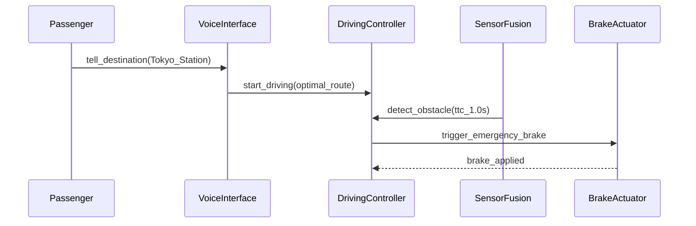

## The Outsourcing You Didn't Notice

Here's a thought experiment.

You hand a contractor a vague brief — "build me a nice app" — and what comes back is... creative. Features you never asked for. Interpretations you never intended. A login page with a CAPTCHA that requires solving differential equations.

Now replace "contractor" with "AI agent."

Same process. Same failure modes.

Spec → Build → Review → Accept. That's all software development has ever been, whether the builder is a team in another timezone or a language model on your machine.

* * *

I've been building software almost entirely with Claude Code, and one thing became painfully clear:

**The quality of AI-generated code depends on three things:**

1. The AI's capability
2. The development process
3. The spec you feed it

Number 1? Claude Code. No complaints.

[Number 2? I'm working on that.](https://github.com/GoodRelax/claude-code-full-auto-dev)

Number 3 is the problem.

Too vague, and the AI hallucinates — features sprout like weeds in an untended garden. Too verbose, and it drowns in context, losing sight of what actually matters.

IEEE 29148 specs are rigorous and beautiful, but feed 200 pages to an LLM and it wanders off like a tourist without a map. A casual "make me a Todo app" works fine — until authentication and state machines enter the picture, and everything collapses.

I tried many formats. What I learned:

**Traditional spec templates were never designed for AI.**

So what *does* an AI need from a spec? That question led me to build something.

* * *

## ANMS — AI-Native Minimal Spec

I didn't invent new notations. The notations already existed — EARS, Gherkin, Mermaid — each brilliant in its own right, built by people far smarter than me.

What I did was this: through months of nearly-full-auto development, I mapped out exactly *where AI gets confused*, then assigned the best existing notation to each layer, and organized the chapters using Clean Architecture principles.

The result is **ANMS (AI-Native Minimal Spec)** — a spec template recomposed for AI-driven development.

* * *

## Stable Top, Flexible Bottom

Not every part of a spec changes at the same rate.

Your project's goal? Rarely changes. Gherkin scenarios? They change all the time.

So why treat them with equal weight?

Here I borrowed from Robert C. Martin's **Stable Dependencies Principle** — depend on stable things, not unstable ones — and applied it to document structure instead of code.

```
Ch1  Foundation        ← Rigid: rarely changes
Ch2  Requirements
Ch3  Architecture
Ch4  Specification     ← Flexible: changes often
Ch5  Test Strategy
Ch6  Design Principles ← Becomes AI's code review criteria
```

Upper chapters constrain lower ones. Never the reverse.

Change a Gherkin scenario in Ch4 → Ch1 and Ch2 are untouched.
Change the Goal in Ch1 → everything below needs review.

The key insight: applying SDP to *documents*, not code. This tells the AI **which context takes priority** — structurally, not by hoping it figures it out.

* * *

## The Right Notation for Each Layer

One notation can't cover everything. So I picked the best fit for each chapter — standing on the shoulders of giants.

| Chapter        | Notation              | Why                                           |
| -------------- | --------------------- | --------------------------------------------- |
| **Foundation** | Natural language + tables | Humans define goals, scope, and constraints |
| **Requirements** | EARS syntax          | Structured patterns eliminate ambiguity       |
| **Architecture** | Mermaid (color-coded) | Humans and AI sync on structure visually     |
| **Specification** | Gherkin             | AI generates test code directly from this    |

### Ch1: Foundation — Natural Language + Tables

Goal (what to build), Scope (how far to go), Constraint (what to respect). Defined in plain language and tables.

This is where you spend the most time — and it's worth every minute. The foundation is *your* intent crystallized.

### Ch2: Requirements — EARS

"The system shall handle errors appropriately."

...*appropriately*? Hand that to an AI and it'll interpret it however it pleases.

EARS (Mavin et al., 2009) eliminates this:

- **When** a collision with a forward obstacle is predicted within 1 second, **the System shall** activate emergency braking immediately.
- **While** operating in autonomous mode, **the System shall** maintain lane center within ±15 cm.

Six patterns. Zero ambiguity. Originally from embedded systems requirements engineering — turns out it's a perfect match for AI-driven development.

### Ch3: Architecture — Mermaid

In AI-driven development, a Mermaid diagram is **not an illustration. It is the design itself.**

The AI reads component diagrams and determines file splits, import paths, and dependency direction. ANMS mandates color-coding by architectural layer — because Mermaid's layout engine has a mind of its own, and without color, there's no telling which box belongs where.

### Ch4: Specification — Gherkin

Gherkin scenarios serve as acceptance tests and, in a TDD context, implementation specs. Each scenario traces back to a requirement via `(traces: FR-xxx)`, so nothing falls through the cracks.

* * *

## A Concrete Example: "The Chauffeur Car"

I can't show the entire spec here, but let me walk through the concept-to-spec flow.

**Foundation:**

> **Goal:** Provide the "just tell me where to go" experience — 24/7, without a human driver.
> **Constraint:** Emergency brake response time ≤ 100 ms (ISO 22737).

**Requirements (EARS):**

> When a collision with a forward obstacle is predicted within 1 second, the System shall activate emergency braking immediately.

**Architecture (Mermaid):**



**Specification (Gherkin):**

```gherkin
Feature: Chauffeur Mode

  Scenario: SC-002 Emergency stop on forward obstacle (traces: FR-003)
    Given the vehicle is in chauffeur mode driving at 40 km/h
    When a collision with a pedestrian ahead is predicted within 1 second
    Then the system activates emergency braking within 100 ms
    And the vehicle comes to a safe stop
```

Four steps. From concept to testable spec. The AI knows exactly what to build, what to test, and what constraints to obey.

* * *

## What Humans Still Do

Even in near-full-auto development, three things remain human work:

1. **Decide the concept**
2. **Make the critical calls**
3. **Review the output**

Everything else? Let the AI handle it. You review the points that matter.

* * *

## Resources

The template and the essay (explaining *why* this structure) are on GitHub.

👉 **[ANMS Template & Essay](https://github.com/GoodRelax/claude-code-full-auto-dev/tree/main/anms-template/)**

| File | Contents |
| ---- | -------- |
| [`anms-essay-ja.md`](https://github.com/GoodRelax/claude-code-full-auto-dev/tree/main/anms-template/anms-essay-ja.md) | Full essay (Japanese) |
| [`anms-spec-template-ja.md`](https://github.com/GoodRelax/claude-code-full-auto-dev/tree/main/anms-template/anms-spec-template-ja.md) | Spec template (Japanese) |
| [`anms-essay-en.md`](https://github.com/GoodRelax/claude-code-full-auto-dev/tree/main/anms-template/anms-essay-en.md) | Full essay (English) — rationale & comparison with existing formats |
| [`anms-spec-template-en.md`](https://github.com/GoodRelax/claude-code-full-auto-dev/tree/main/anms-template/anms-spec-template-en.md) | Spec template (English) |

Try plugging it into your next AI-driven project. If you find improvements or different combinations that work, I'd love to hear about them.

I prefer building in the open — it's more fun that way.

© 2026 GoodRelax. MIT License.
