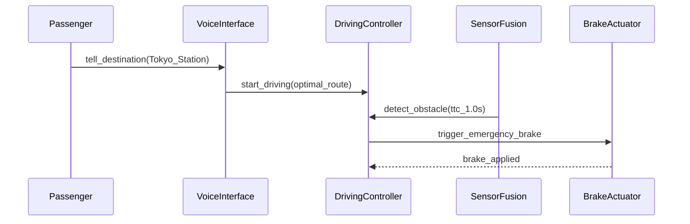

## Why I Made This

I build software with Claude Code, and it hit me:

AI coding is the same process as outsourcing. Spec → Build → Review → Accept. Whether the builder is a team overseas or an LLM on your machine — same flow, same failure modes.

The quality of outsourced software comes down to three things:

1. The vendor's capability
2. The development process
3. The spec

Number 1? Claude Code. No complaints.

[Number 2? Working on it.](https://github.com/GoodRelax/claude-code-full-auto-dev)

Number 3 is the problem. Too vague → the AI hallucinates features you never asked for. Too verbose → it drowns in context and loses sight of what matters.

IEEE 29148 specs are rigorous, but feed 200 pages to an LLM and it gets lost. A casual "make me a Todo app" works — until auth and state machines show up, then everything breaks.

What I learned after trying many formats: **traditional spec templates weren't designed for AI.**

So what *does* an AI need from a spec? That question led me to build…

## ANMS — AI-Native Minimal Spec

A spec template that reorganizes existing notations — EARS, Gherkin, Mermaid — for AI-driven development.

Each notation is someone else's brilliant work. What I did: through months of near-full-auto development, I mapped out where AI gets confused, assigned the best notation to each layer, and structured the chapters using Clean Architecture principles.

## Stable Top, Flexible Bottom

Not every part of a spec changes at the same rate.

- Project goals and constraints → rarely change
- Gherkin scenarios → change all the time

So why treat them with equal weight?

I applied Robert C. Martin's **Stable Dependencies Principle** (SDP) — depend on stable things, not unstable ones — to document structure instead of code.

```
Ch1  Foundation        ← Rigid: rarely changes
Ch2  Requirements
Ch3  Architecture
Ch4  Specification     ← Flexible: changes often
Ch5  Test Strategy
Ch6  Design Principles ← Becomes AI's code review criteria
```

Upper chapters constrain lower ones. Never the reverse.

Change a Gherkin scenario in Ch4 → Ch1 and Ch2 are untouched.
Change the Goal in Ch1 → everything below needs review.

Applying SDP to *documents*, not code — that's the key. It tells the AI **which context takes priority**, structurally.

## The Right Notation for Each Layer

One notation can't cover everything. So I picked the best fit for each chapter — standing on the shoulders of giants.

| Chapter | Notation | Why |
| --- | --- | --- |
| **Foundation** | Natural language + tables | Humans define goals, scope, constraints |
| **Requirements** | EARS syntax | Structured patterns eliminate ambiguity |
| **Architecture** | Mermaid (color-coded) | Humans and AI sync on structure visually |
| **Specification** | Gherkin | AI generates test code directly from this |

### Ch1: Foundation — Natural Language + Tables

Goal (what to build), Scope (how far), Constraint (what to respect). Plain language and tables.

This is where you spend the most time — and it's worth it. The foundation is your intent, crystallized.

### Ch2: Requirements — EARS

"The system shall handle errors appropriately."

…*appropriately*? Hand that to an AI and it'll do whatever it wants.

EARS (Mavin et al., 2009) fixes this:

- **When** a collision with a forward obstacle is predicted within 1 second, **the System shall** activate emergency braking immediately.
- **While** operating in autonomous mode, **the System shall** maintain lane center within ±15 cm.

Six patterns. Zero ambiguity. Originally from embedded systems — turns out it's a perfect fit for AI-driven development.

### Ch3: Architecture — Mermaid

In AI-driven development, a Mermaid diagram is **not an illustration — it's the design itself.**

The AI reads component diagrams to determine file splits, import paths, and dependency direction. ANMS requires color-coding by architectural layer — Mermaid's layout engine does its own thing, so without color, you can't tell which box belongs where.

### Ch4: Specification — Gherkin

Gherkin scenarios serve as acceptance tests — and in TDD, implementation specs. Each scenario traces back to a requirement via `(traces: FR-xxx)`, so nothing falls through the cracks.

## Example: "The Chauffeur Car"

Can't show the full spec here, but here's the concept-to-spec flow.

**Foundation:**

> **Goal:** Provide the "just tell me where to go" experience — 24/7, no human driver.
> **Constraint:** Emergency brake response ≤ 100 ms (ISO 22737).

**Requirements (EARS):**

> When a collision with a forward obstacle is predicted within 1 second, the System shall activate emergency braking immediately.

**Architecture (Mermaid):**



**Specification (Gherkin):**

```gherkin
Feature: Chauffeur Mode

  Scenario: SC-002 Emergency stop on forward obstacle (traces: FR-003)
    Given the vehicle is in chauffeur mode driving at 40 km/h
    When a collision with a pedestrian ahead is predicted within 1 second
    Then the system activates emergency braking within 100 ms
    And the vehicle comes to a safe stop
```

Four steps. Concept to testable spec. The AI knows what to build, what to test, and what constraints to obey.

## What Humans Still Do

Even in near-full-auto development, three things stay human:

1. **Decide the concept**
2. **Make the critical calls**
3. **Review the output**

Everything else? Let the AI handle it. You review what matters.

## Resources

The template and essay (explaining *why* this structure) are on GitHub.

👉 **[ANMS Template & Essay](https://github.com/GoodRelax/claude-code-full-auto-dev)**

| File | Contents |
| ---- | -------- |
| [`anms-essay-ja.md`](https://github.com/GoodRelax/claude-code-full-auto-dev/tree/main/essays/anms-essay-ja.md) | Full essay (Japanese) |
| [`spec-template-ja.md`](https://github.com/GoodRelax/claude-code-full-auto-dev/tree/main/process-rules/spec-template-ja.md) | Spec template (Japanese) |
| [`anms-essay-en.md`](https://github.com/GoodRelax/claude-code-full-auto-dev/tree/main/essays/anms-essay-en.md) | Full essay (English) — rationale & comparison with existing formats |
| [`spec-template-en.md`](https://github.com/GoodRelax/claude-code-full-auto-dev/tree/main/process-rules/spec-template-en.md) | Spec template (English) |

Try it in your next AI-driven project. If you find improvements or different combos that work, I'd love to hear about them.

I prefer building in the open — more fun that way.

© 2026 GoodRelax. MIT License.
