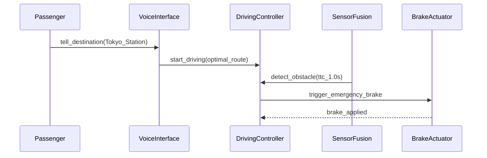

## きっかけ

Claude Code でソフトウェア開発をやっていて、常々思う。

AIコーディングは、他所の会社にソフトを作ってもらうのと全く同じプロセスだ。  
　プロセス: 仕様提示 → ソフト作成 → 受入テスト → 検収 ※途中で適宜レビュー

だからほぼ全自動でソフト開発できる時代が来てるし、自分もそれについていこうとしている。

経験上、外注ソフトの品質は下記の3点にかかっている

1. 依頼先の能力
2. 開発プロセス
3. 仕様書の品質

まぁ、1番はClaude Codeなら文句なし。

[2番はこっちでトライアル中](https://github.com/GoodRelax/claude-code-full-auto-dev)

問題は3番。
仕様が曖昧すぎるとハルシネーションを起こして、頼んでもいない機能が生えてくる。
冗長すぎるとコンテキストに溺れて、大事なことを見失う。

IEEE 29148 準拠の仕様書は厳密で素晴らしいけど、
200ページをLLMに食わせたら確実に迷子になる。  
「Todoアプリ作って」のカジュアル指示は、
認証やステートマシンが出てきた瞬間に破綻する。
他の書式も一長一短ある。

いろいろ試して分かったこと : **従来の仕様書テンプレは、AI向けに設計されていない。**

じゃあ AI 用の仕様書って何が必要なんだ？ と考えて作ったのが...

## ANMS — AI-Native Minimal Spec

既存の優れた記法 — EARS、Gherkin、Mermaid — を
「AI駆動開発」という文脈で再構成した仕様書テンプレート。  
名前は **ANMS（AI-Native Minimal Spec）**。

個々の記法は先人たちの仕事だ。  
自分がやったのは、ほぼ全自動開発を実際にやる中で「AIが迷う箇所」を洗い出し、
それぞれの層に最適な記法を当てはめ、  
Clean Architecture の考え方で章構成を組んだこと。

## 章構成: STFB — Stable Top, Flexible Bottom（上剛下柔）

仕様書のすべての部分が、同じ頻度で変わるわけじゃない。

- プロジェクトの目標や制約 → ほとんど変わらない
- Gherkinシナリオ → しょっちゅう変わる

なのに、なぜ同じ重みで扱うのか？

ここで Robert C. Martin の **安定依存の原則**（**SDP** / Stable Dependencies Principle）を適用した。  
安定したものに依存せよ、不安定なものには依存するな。  
これをドキュメント構造に当てはめる。

```
Ch1  Foundation      基本事項       ← Rigid / 剛: rarely changes / めったに変わらない
Ch2  Requirements    要求
Ch3  Architecture    構造
Ch4  Specification   仕様           ← Flexible / 柔: changes often / よく変わる
Ch5  Test Strategy   テスト戦略
Ch6  Design Principles 設計原則   ← AIのコードレビュー基準になる
```

上の章が下の章を制約する。逆はない。

Ch4 の Gherkin シナリオを変えても → Ch1, Ch2 は影響なし。
Ch1 の Goal を変えたら → それより下は全部見直し。

SDPをコードではなく仕様書に適用するのがポイント。
AIに **どのコンテキストを優先すべきか** を構造的に伝え、
変更の影響範囲を限定できる。

以降は各章の書き方を紹介しよう。

## 章ごとに最適な記法

一つの記法で全部カバーするのは無理。
だから各章にフィットする既存の記法を選んだ。
（巨人の肩に乗せてもらった）

| 章           | Chapter       | 記法                  | なぜ                                     |
| ------------ | ------------- | --------------------- | ---------------------------------------- |
| **基本事項** | Foundation    | 自然言語 + テーブル   | 人間が目標・範囲・制約を定義する         |
| **要求**     | Requirements  | EARS構文              | 構造化パターンで曖昧さを排除             |
| **構造**     | Architecture  | Mermaid（色分け必須） | 人間とAIで構造を視覚的に同期             |
| **仕様**     | Specification | Gherkin               | AIがテストコードを直接生成する入力になる |

### 👉 Ch1: 基本事項は自然言語 + テーブル

Goal（何を作るか）、Scope（どこまで作るか）、Constraint（何を守るか）を 自然言語とテーブルで定義する。
ここだけは自身の経験と好みをかなり反映した。
プロジェクトの土台なので、AIと仕様を作り上げる時に一番時間をかける価値がある章。

### 👉 Ch2: 要求には EARS

「システムはエラーを適切にハンドリングすべき」

……_適切_ って何だ？ AIにこれを渡したら好き勝手に解釈される。

EARS（Mavin et al., 2009）ではこう書く：

- **When** 前方障害物との衝突まで1秒以内と判定された場合, the System **shall** 即座に緊急ブレーキを作動させる。
- **While** 自動運転モードで走行中, the System **shall** 車線中央を±15cm以内で維持する。

こんな感じのが6パターン、曖昧さゼロ。  
もともと組込み系の要求定義で使われていた記法だけど、AI駆動開発との相性が抜群に良い。

### 👉 Ch3: アーキテクチャには Mermaid

AI駆動開発における Mermaid 図は **イラストじゃない、設計そのもの** だ。

AIはコンポーネント図を読んで、ファイル分割・import設定・依存方向を正確に判断する。  
ANMS ではアーキテクチャレイヤーごとの色分けを必須にしている。  
Mermaid のレイアウトエンジンは気まぐれなので、
色がないとどのボックスがどのレイヤーか判別できない。

### 👉 Ch4: テスト仕様には Gherkin

Gherkin シナリオは受入テストであり、
TDD（Test Driven Development）の文脈だと実装仕様でもある。  
各シナリオに `(traces: FR-xxx)` で要求IDをトレースバックするので、
抜け漏れが起きない。

## 具体例:「お抱え運転手付きの車」

全部は書けないので、この記事ではコンセプト → 仕様 の流れを見てほしい。

:::details 具体例:「お抱え運転手付きの車」の仕様化
**Foundation:**

> **Goal:** 「行き先を告げるだけ」の体験を、人間の運転手なしで24時間365日提供する。  
> **Constraint:** 緊急ブレーキの応答時間 100ms 以内（ISO 22737）。

**Requirements (EARS):**

> When 前方障害物との衝突まで1秒以内と判定された場合, the System shall 即座に緊急ブレーキを作動させる。

**Architecture (Mermaid シーケンス図):**



**Specification (Gherkin):**

```gherkin
Feature: Chauffeur Mode

  Scenario: SC-002 前方障害物検知による緊急停止 (traces: FR-003)
    Given 車両はお抱え運転手モードで時速40kmで走行中
    When 前方の歩行者との衝突まで1秒以内と判定される
    Then システムは100ms以内に緊急ブレーキを作動させる
    And 車両は安全に停止する
```

:::

コンセプトからテスト可能な仕様まで4ステップ。
AIは何を作り、何をテストし、何の制約を守るべきか、
正確に把握できる。

## 人間がやること

ほぼ全自動でも、3つだけは人間の仕事。

1. **コンセプトを決める** — ソフトのコンセプトと解決すべき課題を明文化する（Ch1）
2. **重要な判断を下す** — 技術選定や仕様の分岐点で意志入れする（AIが適切なタイミングでユーザーに問いかける）
3. **成果物を確認する** — 成果物が要件を満たすか最終確認・承認する（Ch4を中心にAIが提示する成果物確認の提案をベースに）

それ以外？ AIにやらせて、人間はポイントだけレビューすればいい。

## 今回の成果物

テンプレートと論文（なぜこの構成にしたかの根拠）は GitHub に置いてある。

👉 **[github.com/GoodRelax/articles/tree/main/ai-native-spec](https://github.com/GoodRelax/articles/tree/main/ai-native-spec)**

| ファイル                                                                                                              | 内容                                             |
| --------------------------------------------------------------------------------------------------------------------- | ------------------------------------------------ |
| [`anms-essay-ja.md`](https://github.com/GoodRelax/articles/tree/main/ai-native-spec/anms-essay-ja.md)                 | 論文全文（日本語）                               |
| [`anms-spec-template-ja.md`](https://github.com/GoodRelax/articles/tree/main/ai-native-spec/anms-spec-template-ja.md) | テンプレート本体（日本語）                       |
| [`anms-essay.md`](https://github.com/GoodRelax/articles/tree/main/ai-native-spec/anms-essay.md)                       | 論文全文（英語）。根拠と既存フォーマットとの比較 |
| [`anms-spec-template.md`](https://github.com/GoodRelax/articles/tree/main/ai-native-spec/anms-spec-template.md)       | テンプレート本体（英語）                         |

次のAI駆動プロジェクトに取り込んでみては？
改善点や別の組み合わせのアイデアがあれば共有してくれると嬉しい。  
独占しないでみんなで楽しくやるのが好きだから♪

© 2026 GoodRelax. MIT License.
