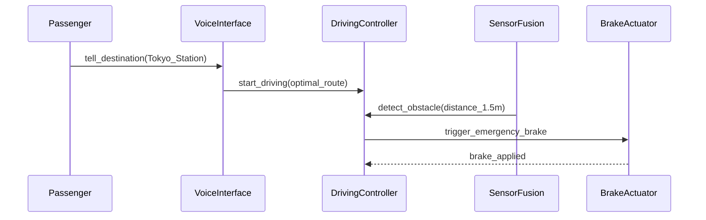

仕様書はプロンプトだ。気づいているかどうかに関わらず。

AIコーディングエージェントに仕様書を渡すたびに、あなたは世界で最もコストの高いプロンプトを書いていることになる。曖昧すぎると、AIは頼んでもいない機能をハルシネーションで生み出す。冗長すぎると、コンテキストに溺れて本当に重要なことを見失う。

私はしばらくAIエージェント（Claude Code等）でソフトウェアを作ってきたが、いつも同じ壁にぶつかっていた。**従来の仕様書はAI向けに設計されていない。** IEEE 29148は規制準拠には最高だが、200ページをLLMに食わせてみるといい。かといって「Todoアプリ作って」のカジュアルなプロンプトは、認証やエラーハンドリング、ステートマシンが必要になった瞬間に破綻する。

だから、AI駆動開発のためにゼロから設計した仕様書テンプレートを作った。**ANMS — AI-Native Minimal Spec** と呼んでいる。

## コアアイデア: STFB（上剛下柔）

着眼点はこうだ。仕様書のすべての部分が同じ頻度で変わるわけではない。

プロジェクトの目標や制約はほとんど変わらない。Gherkinシナリオはしょっちゅう変わる。なのに、なぜ同じように扱うのか？

ANMSはRobert C. Martinの**安定依存の原則**を借りて、ドキュメント構造に適用する：

```
Chapter 1  Foundation       ← 剛: めったに変わらない
Chapter 2  Requirements
Chapter 3  Architecture
Chapter 4  Specification    ← 柔: よく変わる
Chapter 5  Test Strategy
Chapter 6  Design Principles
```

上位の章は下位の章を制約するが、逆はない。Ch4のGherkinシナリオを変えても、Ch1やCh2は影響を受けない。Ch1のGoalを変えたら？ それより下は全部見直しだ。

これは単にきれいに整理しただけではない。AIに**どのコンテキストを優先すべきか**を伝え、変更の影響範囲を限定する仕組みだ。

## 単一フォーマットでは足りない

一つの記法ですべてをカバーすることはできない。だからANMSは**ハイブリッドアプローチ**を取り、各層に最適なツールを選ぶ：

| 層 | 記法 | 理由 |
|----|------|------|
| **Foundation** | 自然言語 + テーブル | 人間が目標・範囲・制約を定義する |
| **Requirements** | EARS構文 | 構造化パターンで曖昧さを排除する |
| **Architecture** | Mermaid（色分け必須！） | 人間とAIで構造を視覚的に同期する |
| **Specification** | Gherkin | AIがこれから直接テストコードを生成する |

### 要求にはEARS

「システムはエラーを適切にハンドリングすべき」の代わりに（*適切*って何だ？）、EARSはパターンを与える：

- **When** [トリガー], the System **shall** [応答]. *（イベント駆動）*
- **While** [状態], the System **shall** [応答]. *（状態依存）*
- **If** [トリガー], then the System **shall** [応答]. *（例外処理）*

6パターン、曖昧さゼロ。

### アーキテクチャにはMermaid

AI駆動開発におけるMermaid図について言いたいことがある。**これはイラストではなく、設計そのものだ。** AIはコンポーネント図を読んで、ファイル分割の方法、importの設定、依存方向の遵守を正確に判断する。

ANMSはアーキテクチャレイヤーごとの色分けを必須にしている。Mermaidのレイアウトエンジンは予測不能なので、色がないとどのボックスがどのレイヤーに属するか判別できないからだ。

### 仕様にはGherkin

Gherkinシナリオは受入テストであると同時に実装仕様でもある。各シナリオは `(traces: FR-xxx)` で要求にトレースバックされるので、抜け漏れが起きない。

## 具体例:「お抱え運転手付きの車」

ANMSが実際にどう見えるか。コンセプト：**専属運転手のような自動運転。**

**Foundation:**
> Goal: 「行き先を告げるだけ」の体験を、人間の運転手なしで24時間365日提供する。
> Constraint: 緊急ブレーキの応答時間100ms以内（ISO 22737）。

**Requirements (EARS):**
> When 前方2m以内に障害物を検知した場合, the System shall 即座に緊急ブレーキを作動させる。

**Architecture (Mermaid):**


**Specification (Gherkin):**
```gherkin
Feature: Chauffeur Mode

  Scenario: SC-002 前方障害物検知による緊急停止 (traces: FR-003)
    Given 車両はお抱え運転手モードで時速40kmで走行中
    When 前方1.5mに歩行者を検知する
    Then システムは100ms以内に緊急ブレーキを作動させる
    And 車両は安全に停止する
```

コンセプトからテスト可能な仕様まで4ステップ。AIは何を作り、何をテストし、何の制約を守るべきか正確に把握できる。

## 人間がやること

ほぼ全自動でも、3つだけは人間の仕事だ：

1. **コンセプトを定義する** — AIに*何を*作るか伝える（Ch1）
2. **重要な判断を下す** — アーキテクチャを選び、曖昧さを解消する（Ch3）
3. **結果を受け入れる** — UAT、最終的なPASS/FAIL判定（Ch4）

それ以外？ まずAIにやらせて、人間がレビューすればいい。

## 使ってみる

論文全文とテンプレートはGitHubにある：

**[github.com/GoodRelax/articles/tree/main/ai-native-spec](https://github.com/GoodRelax/articles/tree/main/ai-native-spec)**

- `anms-essay.md` — 根拠と既存フォーマットとの比較を含む論文全文
- `anms-spec-template.md` — 今日から使えるテンプレート

次のAI駆動プロジェクトに放り込んでみてほしい。フォークして、改造して、壊してみてくれ。何がうまくいって何がダメだったか、ぜひ聞かせてほしい。
