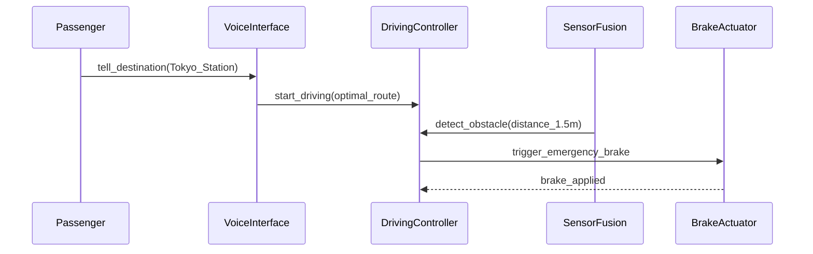

Your spec is a prompt. Whether you realize it or not.

Every time you hand a specification to an AI coding agent, you're essentially writing the world's most expensive prompt. Too vague, and the AI hallucinates features you never asked for. Too verbose, and it drowns in context, losing track of what actually matters.

I've been building software with AI agents (Claude Code, etc.) for a while, and I kept hitting the same wall: **traditional specs weren't designed for AI.** IEEE 29148 is great for regulatory compliance, but try feeding 200 pages of it to an LLM. And a casual "build me a todo app" prompt works until your app needs auth, error handling, and a state machine.

So I built a spec template designed from the ground up for AI-driven development. I call it **ANMS — AI-Native Minimal Spec**.

## The Core Idea: STFB (Stable Top, Flexible Bottom)

Here's the insight: not all parts of a spec change at the same rate.

Your project's goals and constraints? Those barely change. Your Gherkin scenarios? Those change all the time. So why do we treat them the same?

ANMS borrows from Robert C. Martin's **Stable Dependencies Principle** and applies it to document structure:

```
Chapter 1  Foundation       ← Rigid: rarely changes
Chapter 2  Requirements
Chapter 3  Architecture
Chapter 4  Specification    ← Flexible: changes often
Chapter 5  Test Strategy
Chapter 6  Design Principles
```

Upper chapters constrain lower chapters, but not vice versa. Change a Gherkin scenario in Ch4? Ch1 and Ch2 don't care. Change a Goal in Ch1? Everything below needs review.

This isn't just tidy organization — it tells the AI **what context to prioritize** and limits the blast radius of changes.

## One Format Doesn't Cut It

No single notation works for everything. So ANMS uses a **hybrid approach**, picking the best tool for each layer:

| Layer | Notation | Why |
|-------|----------|-----|
| **Foundation** | Natural language + Tables | Humans define goals, scope, constraints |
| **Requirements** | EARS syntax | Structured patterns eliminate ambiguity |
| **Architecture** | Mermaid (color-coded!) | Visual sync of structure between human and AI |
| **Specification** | Gherkin | AI directly generates test code from these |

### EARS for Requirements

Instead of "the system should handle errors gracefully" (what does *gracefully* even mean?), EARS gives you patterns:

- **When** [Trigger], the System **shall** [Response]. *(event-driven)*
- **While** [In State], the System **shall** [Response]. *(state-driven)*
- **If** [Trigger], then the System **shall** [Response]. *(exception handling)*

Six patterns, zero ambiguity.

### Mermaid for Architecture

Here's the thing about Mermaid diagrams in AI-driven dev: **they're not illustrations, they're the design itself.** An AI reads your component diagram and knows exactly how to partition files, set up imports, and respect dependency direction.

ANMS mandates color-coding by architecture layer — because Mermaid's layout engine is unpredictable, and without colors, you can't tell which box belongs to which layer.

### Gherkin for Specification

Gherkin scenarios become your acceptance tests *and* your implementation spec. Each scenario traces back to a requirement with `(traces: FR-xxx)`, so nothing falls through the cracks.

## Quick Example: "A Car With a Personal Chauffeur"

Here's what ANMS looks like in practice. Concept: **autonomous driving that feels like having your own chauffeur.**

**Foundation:**
> Goal: Deliver the "just tell it where to go" experience, 24/7, without a human driver.
> Constraint: Emergency brake response within 100ms (ISO 22737).

**Requirements (EARS):**
> When an obstacle is detected within 2m ahead, the System shall immediately activate emergency braking.

**Architecture (Mermaid):**


**Specification (Gherkin):**
```gherkin
Feature: Chauffeur Mode

  Scenario: SC-002 Emergency stop on forward obstacle (traces: FR-003)
    Given the vehicle is driving at 40km/h in Chauffeur Mode
    When a pedestrian is detected 1.5m ahead
    Then the System activates emergency braking within 100ms
    And the vehicle comes to a safe stop
```

From concept to testable spec in four steps. The AI knows exactly what to build, what to test, and what constraints to respect.

## What Humans Still Do

Even with near-full automation, three things stay human:

1. **Define the concept** — tell the AI *what* to build (Ch1)
2. **Make critical decisions** — choose the architecture, resolve ambiguity (Ch3)
3. **Accept the result** — UAT, the final PASS/FAIL (Ch4)

Everything else? Let the AI take the first pass — then review.

## Try It

The full paper and template are on GitHub:

**[github.com/GoodRelax/articles/tree/main/ai-native-spec](https://github.com/GoodRelax/articles/tree/main/ai-native-spec)**

- `anms-essay.md` — the full paper with rationale and comparison
- `anms-spec-template.md` — the template you can use today

Drop it into your next AI-driven project. Fork it, adapt it, break it. I'd love to hear what works and what doesn't.
