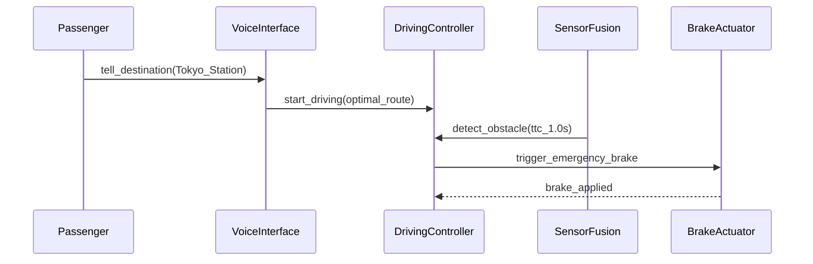

## あなたが気づかなかった外注

思考実験をしてみよう。

外注先にざっくりした指示を渡す ―「いい感じのアプリ作って」― すると返ってくるのは…クリエイティブなもの。頼んでもない機能。意図してない解釈。微分方程式を解かないと通れないCAPTCHAのログインページ。

ここで「外注先」を「AIエージェント」に置き換えてみよう。

同じプロセス。同じ失敗パターン。

仕様 → 構築 → レビュー → 受け入れ。ソフトウェア開発はずっとこれだけだった。作り手が別のタイムゾーンにいるチームであろうと、自分のマシン上の言語モデルであろうと。

* * *

私はほぼ全面的にClaude Codeでソフトウェアを作ってきた。そして一つ、痛いほどはっきりしたことがある：

**AI生成コードの品質は3つのことで決まる：**

1. AIの能力
2. 開発プロセス
3. AIに食わせる仕様書

1番？ Claude Code。文句なし。

[2番？ 今取り組んでいるところ。](https://github.com/GoodRelax/claude-code-full-auto-dev)

3番が問題だ。

曖昧すぎると、AIは幻覚を見る ― 手入れされていない庭の雑草のように機能が勝手に生えてくる。冗長すぎると、コンテキストに溺れ、本当に重要なことを見失う。

IEEE 29148の仕様書は厳密で美しいが、200ページをLLMに食わせると、地図を持たない観光客のように迷走する。カジュアルな「Todoアプリ作って」はうまくいく ― 認証やステートマシンが登場するまでは。そこで全てが崩壊する。

多くのフォーマットを試した。学んだことはこうだ：

**従来の仕様書テンプレートは、AIのために設計されたものではなかった。**

では、AIは仕様書に何を必要としているのか？ その問いが、私を何かを作ることへと導いた。

* * *

## ANMS — AI-Native Minimal Spec

新しい記法を発明したわけではない。記法はすでに存在していた ― EARS、Gherkin、Mermaid ― それぞれが素晴らしく、私よりはるかに賢い人たちが作ったものだ。

私がやったのはこうだ：数ヶ月のほぼフルオート開発を通じて、**AIがどこで混乱するか**を正確にマッピングし、各レイヤーに最適な既存の記法を割り当て、クリーンアーキテクチャの原則を使ってチャプターを構成した。

その結果が**ANMS（AI-Native Minimal Spec）** ― AI駆動開発のために再構成された仕様書テンプレートだ。

* * *

## 上は安定、下は柔軟

仕様書のすべての部分が同じ速さで変わるわけではない。

プロジェクトのゴール？ めったに変わらない。Gherkinシナリオ？ しょっちゅう変わる。

なぜそれらを同じ重みで扱うのか？

ここで、Robert C. Martinの**安定依存の原則（Stable Dependencies Principle）** ― 安定したものに依存せよ、不安定なものには依存するな ― を借用し、コードではなくドキュメント構造に適用した。

```
Ch1  Foundation（基盤）    ← 堅い：めったに変わらない
Ch2  Requirements（要件）
Ch3  Architecture（アーキテクチャ）
Ch4  Specification（仕様）  ← 柔軟：よく変わる
Ch5  Test Strategy（テスト戦略）
Ch6  Design Principles（設計原則） ← AIのコードレビュー基準になる
```

上位チャプターが下位チャプターを制約する。逆は決してない。

Ch4のGherkinシナリオを変更 → Ch1とCh2は影響なし。
Ch1のゴールを変更 → それ以下すべてがレビュー対象。

重要な洞察：SDPを*コード*ではなく*ドキュメント*に適用すること。これにより、AIが勝手に判断するのを期待するのではなく、**どのコンテキストが優先されるか**を構造的に伝えることができる。

* * *

## 各レイヤーに最適な記法を

一つの記法ですべてをカバーすることはできない。だから、各チャプターに最適なものを選んだ ― 巨人の肩の上に立って。

| チャプター | 記法 | 理由 |
| -------------- | --------------------- | --------------------------------------------- |
| **Foundation** | 自然言語 + テーブル | 人間がゴール、スコープ、制約を定義する |
| **Requirements** | EARS構文 | 構造化パターンが曖昧さを排除する |
| **Architecture** | Mermaid（色分け付き） | 人間とAIが構造を視覚的に共有する |
| **Specification** | Gherkin | AIがこれから直接テストコードを生成する |

### Ch1: Foundation（基盤） ― 自然言語 + テーブル

ゴール（何を作るか）、スコープ（どこまでやるか）、制約（何を守るか）。平易な言葉とテーブルで定義する。

ここに最も時間をかける ― そしてその時間には十分な価値がある。基盤は*あなたの*意図の結晶だ。

### Ch2: Requirements（要件） ― EARS

「システムは適切にエラーを処理すること。」

…*適切に*？ これをAIに渡したら、好き勝手に解釈する。

EARS（Mavin et al., 2009）はこれを排除する：

- **When** 前方障害物との衝突が1秒以内に予測された場合、**the System shall** 緊急ブレーキを即座に作動させる。
- **While** 自律走行モードで動作中、**the System shall** 車線中央を±15 cm以内に維持する。

6つのパターン。曖昧さゼロ。もともと組み込みシステムの要件工学から生まれたもの ― AI駆動開発にも完璧にマッチすることがわかった。

### Ch3: Architecture（アーキテクチャ） ― Mermaid

AI駆動開発において、Mermaid図は**イラストではない。設計そのものだ。**

AIはコンポーネント図を読み取り、ファイル分割、インポートパス、依存方向を決定する。ANMSではアーキテクチャレイヤーごとの色分けを必須としている ― Mermaidのレイアウトエンジンは気まぐれで、色がなければどのボックスがどこに属するか判別できないからだ。

### Ch4: Specification（仕様） ― Gherkin

Gherkinシナリオは受け入れテストとして、またTDDの文脈では実装仕様として機能する。各シナリオは`(traces: FR-xxx)`を通じて要件にトレースバックされるため、抜け漏れが生じない。

* * *

## 具体例：「ショーファーカー」

仕様の全体をここに示すことはできないが、コンセプトから仕様へのフローを説明しよう。

**Foundation（基盤）：**

> **ゴール：** 「行き先を言うだけ」の体験を提供する ― 24時間365日、人間のドライバーなしで。
> **制約：** 緊急ブレーキの応答時間 ≤ 100 ms（ISO 22737）。

**Requirements（要件）（EARS）：**

> 前方障害物との衝突が1秒以内に予測された場合、システムは緊急ブレーキを即座に作動させる。

**Architecture（アーキテクチャ）（Mermaid）：**



**Specification（仕様）（Gherkin）：**

```gherkin
Feature: Chauffeur Mode

  Scenario: SC-002 Emergency stop on forward obstacle (traces: FR-003)
    Given the vehicle is in chauffeur mode driving at 40 km/h
    When a collision with a pedestrian ahead is predicted within 1 second
    Then the system activates emergency braking within 100 ms
    And the vehicle comes to a safe stop
```

4ステップ。コンセプトからテスト可能な仕様まで。AIは何を作り、何をテストし、どの制約に従うべきかを正確に把握できる。

* * *

## 人間がまだやること

ほぼフルオート開発においても、3つのことは人間の仕事として残る：

1. **コンセプトを決める**
2. **重要な判断を下す**
3. **アウトプットをレビューする**

それ以外は？ AIに任せよう。あなたは重要なポイントだけレビューすればいい。

* * *

## リソース

テンプレートとエッセイ（*なぜ*この構造なのかを説明したもの）はGitHubにある。

👉 **[ANMS Template & Essay](https://github.com/GoodRelax/claude-code-full-auto-dev/tree/main/anms-template/)**

| ファイル | 内容 |
| ---- | -------- |
| [`anms-essay-ja.md`](https://github.com/GoodRelax/claude-code-full-auto-dev/tree/main/anms-template/anms-essay-ja.md) | エッセイ全文（日本語） |
| [`anms-spec-template-ja.md`](https://github.com/GoodRelax/claude-code-full-auto-dev/tree/main/anms-template/anms-spec-template-ja.md) | 仕様書テンプレート（日本語） |
| [`anms-essay-en.md`](https://github.com/GoodRelax/claude-code-full-auto-dev/tree/main/anms-template/anms-essay-en.md) | エッセイ全文（英語） — 既存フォーマットとの比較・根拠 |
| [`anms-spec-template-en.md`](https://github.com/GoodRelax/claude-code-full-auto-dev/tree/main/anms-template/anms-spec-template-en.md) | 仕様書テンプレート（英語） |

次のAI駆動プロジェクトに組み込んでみてほしい。改善点や、うまくいく別の組み合わせを見つけたら、ぜひ教えてほしい。

私はオープンに作る方が好きだ ― その方が楽しいから。

© 2026 GoodRelax. MIT License.
