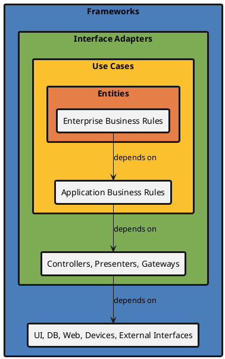
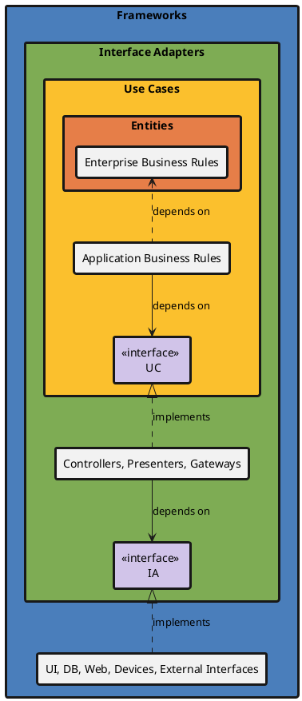

# So, What Does Clean Architecture Really Mean?

A common mistake is confusing **means** with **purpose**.

In the software world, this often shows up as building a system whose goal is simply to use a particular company’s framework.
Once you do that, you end up letting the framework vendor control your business.

The correct approach is to define interfaces within your own system and use the framework through those interfaces.
That way, if you stop liking the framework, you can switch to another one.

This technique—defining your own interfaces to invert dependencies—is called:

- DIP (Dependency Inversion Principle)

Uncle Bob explains this using four layers:

- Entity (Enterprise Business Rules)
- Use Case (Application Business Rules)
- Interface Adapters
- Frameworks

But in the end, it really comes down to this:

- Purpose: Do your work (Use Cases) according to fundamental principles (Entities)
- Means: Draw clear boundaries (Adapters) and use tools (Frameworks) effectively

That’s basically the idea.

Represented as a class diagram, it looks like this.

## Class Diagram of Dirty Architecture (before CA)

A “dirty” state is when dependencies point from the inside to the outside, instead of from the outside to the inside.

<!--

-->

## Class Diagram of Clean Architecture (after CA)

The key point is that inner layers—Use Cases and Interface Adapters—use outer tools through interfaces defined for their own convenience.

<!--

-->

## Just a Personal Take

Isn’t DIP kind of cheating?

Interfaces are like contracts.
If we describe this in a medieval worldview…

- The king uses his subjects according to a contract
- But the contract isn’t managed fairly by a notary—it’s owned by the king
- The subjects think they’re working based on the contract
- But in the end, they’re just doing whatever the king says

That’s basically what’s going on, right?

Whoever came up with this idea was a genius.

References:

- Robert C. Martin, Clean Architecture (2017)
- https://blog.cleancoder.com/uncle-bob/2012/08/13/the-clean-architecture.html
