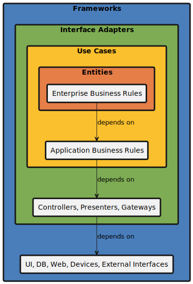
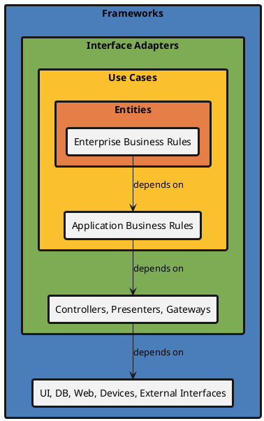
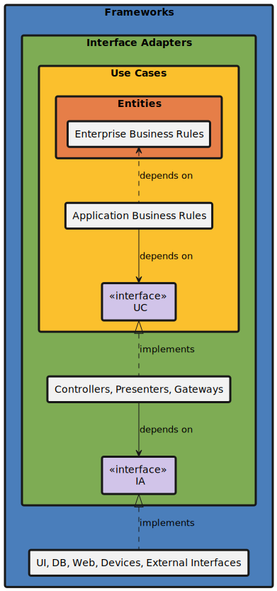
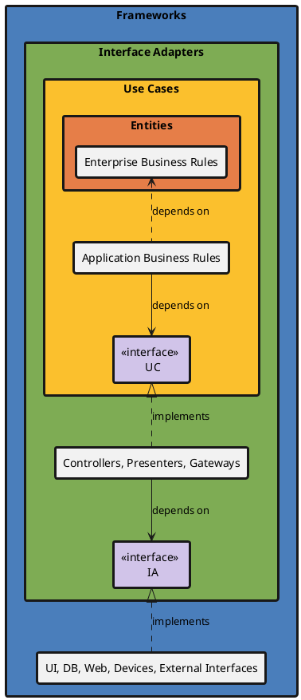

# クリーンアーキテクチャーってつまりこういうこと？

よくある間違いに**手段**と**目的**の混同ってのがある。

ソフトウェアの世界で言うと、どこかの会社のフレームワークを使うことが目的のシステムを作ってしまったケース。
これをやってしまうとフレームワーク提供会社に自社のビジネスを支配されてしまう。

正しくは自社内にインターフェースを設けて、そのインターフェース経由でフレームワークを使う。
こうしておけば、フレームワークが気に入らなくなったら他のに乗り換えれば良い。

この自分でインターフェースを定義することで依存関係を逆転する技が
- DIP (Dependency Inversion Principle)

ってやつ。

ボブおじさん先生は

- Entity (Enterprise Business Rules)
- Use Case (Application Business Rules)
- Interface Adapters
- Frameworks

の4階層で説明されてるけど、つまるところ

- 目的: 原理原則 (Entity) に従ってお仕事 (Use Case) しましょう
- 手段: そのために線引き (Adapter) して道具 (Framework) を上手く使いましょう

ってことかな。
 
クラス図で書くと次の通り。

## Class Diagram of Dirty Architecture (before CA)

依存の向きが内→外ではなく、外→内になっている状態が汚い

<!--

-->

## Class Diagram of Clean Architecture (after CA)

内側の Use Case や Interface Adapter は 自分たちの都合で定義した interface を経由して外側の道具を使うのがポイント

<!--

-->

## ただの感想

DIP (Dependency Inversion Principle)ってずるいよね？
Interface ってのは契約書みたいなもんだけど、中世の世界観で言うと...

 - 王様が契約書に従って領民を使っているが
 - 契約書は公証人役場で公平に管理せずに王様が持っているから
 - 領民は契約書に基づいて働いているつもりだけど
 - 結局は王様の言いなりにされてしまう
 
ってことだよね？ 考えた人は天才だわ。

**参考資料**:
- Robert C. Martin "Clean Architecture" (2017)
- https://blog.cleancoder.com/ーncle-bob/2012/08/13/the-clean-architecture.html

