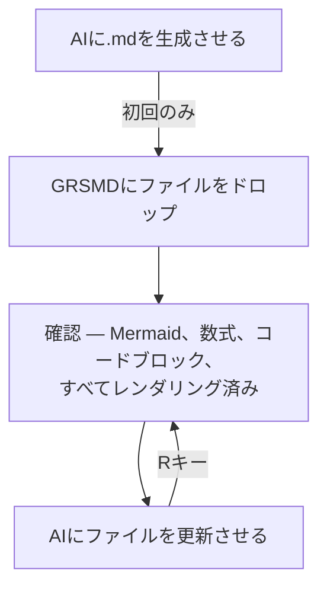

# DevTo版 Gen2記事 — レビュー用和訳

> article_gen2_en.md の日本語対訳。原文のニュアンス確認用。

---

**タイトル:** GRSMD Gen2 — [R]を押せば、AIが書いたものが見える

**description:** AIが.mdを更新、あなたはRを押す。ループはそれだけ。

**tags:** markdown, ai, productivity, webdev

---

## なぜ？

あの感覚、わかるでしょ — AIと一緒にゾーンに入ってるのに、ファイルを開き直して、ドラッグし直して、ページの読み込みを待つ。

たった数秒。でも追い出されるには十分。

## なにした？

[GRSMD](https://dev.to/goodrelax/grsmd-instant-markdown-viewer-local-private-4g8c) — ブラウザ上で完結するMarkdownビューワー。インストール不要、バックエンドなし — にリロード機能を追加した。

### どうやる？

1. `.md`をGRSMDにドロップ
2. AIにファイルを更新させる（レビューコメント、書き直し、なんでも）
3. GRSMDで**[R]**を押す（[Re-load]ボタンでもOK）
   → 更新内容が再描画される — スクロール位置はそのまま

## 試す価値ある？

まぁ、やってみて。

👉 https://goodrelax.github.io/gr-simple-md-renderer/

頭すっきり。サクサク。

---

## ワークフロー

---

## おまけ — コードファイルも

`.py`、`.js`、`.json`など.md以外のテキストファイルをドロップすると、シンタックスハイライト＋行番号付きで表示。Rキーでリロードも可。

コードレビューにも地味に使える。

---

## ショートカット

| キー | 動作 |
|-----|--------|
| **R** | **ファイル再読み込み** |
| L | ライトモード |
| D | ダークモード |
| N | 新しいタブ |
| C | クリア |
| ↑ ↓ | スムーススクロール |

---

## 変わらないもの

- バックエンドなし。データ収集なし。
- PlantUMLだけは外部通信する — 必ず事前に同意を求める。
- 単一HTMLファイル。インストール不要。
- 無料。広告なし。OSS。

---

## 試す

👉 https://goodrelax.github.io/gr-simple-md-renderer/

サンプル:
👉 https://goodrelax.github.io/gr-simple-md-renderer/sample-data.md
👉 https://goodrelax.github.io/gr-simple-md-renderer/sample-data-2.md

GitHub:
👉 https://github.com/GoodRelax/gr-simple-md-renderer

旧記事:
[GRSMD: Instant Markdown Viewer — Local & Private](https://dev.to/goodrelax/grsmd-instant-markdown-viewer-local-private-4g8c)
