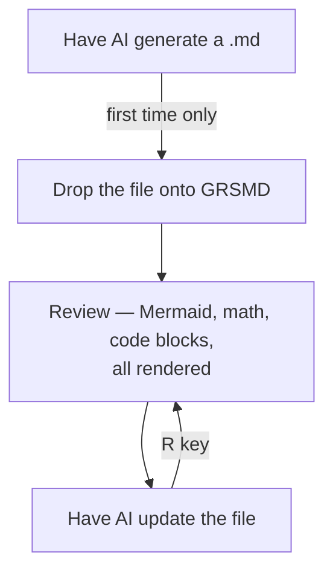

## Why?

I have AI rewrite my docs all the time. VS Code preview works, but it gets sluggish with Mermaid diagrams, math blocks, and long files.

That little lag — just enough to break the flow.

## What I built

[GRSMD](https://dev.to/goodrelax/grsmd-instant-markdown-viewer-local-private-4g8c) is a Markdown viewer that runs entirely in your browser — no install, no backend.
(Previous article: [GRSMD: Instant Markdown Viewer — Local & Private](https://dev.to/goodrelax/grsmd-instant-markdown-viewer-local-private-4g8c))

I just added a reload feature so you never have to re-drag a file again.

### How it works

1. Drop a `.md` onto GRSMD
2. Have AI update the file (review comments, rewrites, whatever)
3. Press **[R]** on GRSMD (or click the [Re-load] button)  
   → The updated content re-renders — scroll position preserved

## Who is this for?

- You use AI to draft or edit Markdown (docs, READMEs, blog posts)
- You want to preview the result without leaving your browser
- You care about privacy — no data leaves your machine

👉 https://goodrelax.github.io/gr-simple-md-renderer/

---

## Workflow

---

## Bonus — code files too

Drop `.py`, `.js`, `.json`, or any non-`.md` text file  
— you get syntax highlighting with line numbers. R key reloads these as well.

Quietly useful for code review.

---

## Shortcuts

| Key   | Action          |
| ----- | --------------- |
| **R** | **Reload file** |
| L     | Light mode      |
| D     | Dark mode       |
| N     | New tab         |
| C     | Clear           |
| ↑ ↓   | Smooth scroll   |

---

## What hasn't changed

- No backend. No data collection.
- PlantUML is the only external call — always asks for consent first.
- Single HTML file. Zero install.
- Free. No ads. OSS.

---

## Try it

👉 https://goodrelax.github.io/gr-simple-md-renderer/

Samples:
👉 https://goodrelax.github.io/gr-simple-md-renderer/sample-data.md
👉 https://goodrelax.github.io/gr-simple-md-renderer/sample-data-2.md

GitHub:
👉 https://github.com/GoodRelax/gr-simple-md-renderer

Previous article:
[GRSMD: Instant Markdown Viewer — Local & Private](https://dev.to/goodrelax/grsmd-instant-markdown-viewer-local-private-4g8c)
