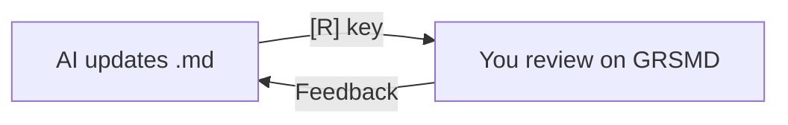

Have AI write a `.md`. Tell it to fix things. Press R.
That's it — the latest content renders instantly.
No re-drop. No browser refresh.

I don't want to break my train of thought.
Re-opening files, re-dragging, waiting for a page reload — those few seconds kill the flow.
GRSMD is built to eliminate that friction.

- **Live:** https://goodrelax.github.io/gr-simple-md-renderer/
- **Source:** https://github.com/GoodRelax/gr-simple-md-renderer

---

## Workflow

Mermaid diagrams, LaTeX math, syntax-highlighted code blocks — all rendered in your browser. Quick check, quick feedback. Repeat.

> Live reload uses the FileSystemFileHandle API (Chrome / Edge 86+).

---

## Bonus: code files too

Drop `.py`, `.js`, `.json`, or any text file — syntax highlighting with line numbers. R key reloads these as well.

---

## Shortcuts

| Key | Action |
|-----|--------|
| **R** | **Reload file** |
| L | Switch to light mode |
| D | Switch to dark mode |
| N | Open new tab |
| C | Clear |
| ↑ ↓ | Smooth scroll |

---

## What hasn't changed

- No backend. No data collection
- PlantUML is the only external call — always asks for consent
- Single HTML file. Zero install
- Free. No ads. OSS.

---

## Try it

- **Live:** https://goodrelax.github.io/gr-simple-md-renderer/
- **Sample:** https://goodrelax.github.io/gr-simple-md-renderer/sample-data.md
- **Full sample:** https://goodrelax.github.io/gr-simple-md-renderer/sample-data-2.md

Drop one of the sample files onto the live page.

Previous article:
[GRSMD: Instant Markdown Viewer — Local & Private](https://dev.to/goodrelax/grsmd-instant-markdown-viewer-local-private-4g8c)
