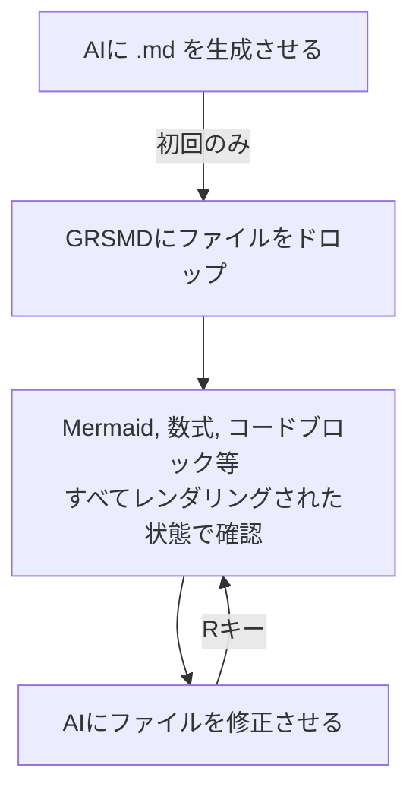

## なぜ？

AI使って何かを考えてる最中に思考を止められるのが、ヤダナー感 ってない？  
せっかく脳がフロー状態になったのに、ファイル開き直したり、表示されるのをチョッと待ったりしていると、フローから追い出されるやつ。

## なにした？

GRSMDにリロード機能を付けました！

### どうやる？

1. .mdをGRSMDにドラッグ&ドロップ
2. AIに.mdを更新させる (例:レビューで指摘するとか)
3. GRSMDで [R]キーを押す ([Re-load] ボタンでもいい。)
   → さっきまで見ていた行を保持したまま、修正版が再描画される

## おいしいの？

まぁ、やってみてください♪

👉 https://goodrelax.github.io/gr-simple-md-renderer/

少なくとも自分は、頭すっきり、サクサクです！

---

## ワークフロー

---

## おまけ: コードも見れる

`.py`, `.js`, `.json` など .md 以外のファイルをドロップすると、シンタックスハイライト＋行番号付きで表示。Rキーでリロードも可。
&nbsp;&nbsp;&nbsp;&nbsp;&nbsp;&nbsp;...コードレビューにも地味に使える。

---

## ショートカット

| キー  | 動作                     |
| ----- | ------------------------ |
| **R** | **ファイルを再読み込み** |
| L     | ライトモードに切替       |
| D     | ダークモードに切替       |
| N     | 新しいタブで開く         |
| C     | クリア                   |
| ↑ ↓   | スムーススクロール       |

---

## 変わらないもの

- バックエンドなし。データ収集なし
- PlantUML だけは外部通信するが、必ず同意ダイアログを出す
- 単一HTMLファイル。インストール不要
- 完全無料。広告無し。OSS。

---

## 試す

👉 https://goodrelax.github.io/gr-simple-md-renderer/

サンプル:
👉 https://goodrelax.github.io/gr-simple-md-renderer/sample-data.md
👉 https://goodrelax.github.io/gr-simple-md-renderer/sample-data-2.md

GitHub:
👉 https://github.com/GoodRelax/gr-simple-md-renderer

旧記事:
[GRSMD — ブラウザだけで動く Markdown ビューワー を作ったよ](https://zenn.dev/good_relax/articles/9d85cc796aac71)
